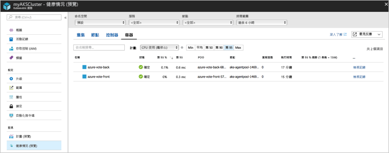

# <a name="quickstart-deploy-an-azure-kubernetes-service-aks-cluster"></a>快速入門：部署 Azure Kubernetes Service (AKS) 叢集

本快速入門中會使用 Azure CLI 來部署 AKS 叢集。 接著，在叢集上執行包含 Web 前端和 Redis 執行個體的多容器應用程式。 完成後，即可透過網際網路來存取應用程式。


本快速入門假設讀者已了解 Kubernetes 的基本概念，如需 Kubernetes 的詳細資訊，請參閱 [Kubernetes 文件][kubernetes-documentation]。

[!INCLUDE [cloud-shell-try-it.md](../../includes/cloud-shell-try-it.md)]

如果您選擇在本機安裝和使用 CLI，本快速入門會要求您執行 Azure CLI 2.0.46 版或更新版本。 執行 `az --version` 以尋找版本。 如果您需要安裝或升級，請參閱[安裝 Azure CLI][azure-cli-install]。

## <a name="create-a-resource-group"></a>建立資源群組

使用 [az group create][az-group-create] 命令來建立資源群組。 Azure 資源群組是在其中部署與管理 Azure 資源的邏輯群組。 建立資源群組時，系統會要求您指定位置。 這個位置是您在 Azure 中執行資源的位置。

下列範例會在 eastus 位置中建立名為 myAKSCluster 的資源群組。

```azurecli-interactive
az group create --name myAKSCluster --location eastus
```

輸出：

```json
{
  "id": "/subscriptions/00000000-0000-0000-0000-000000000000/resourceGroups/myAKSCluster",
  "location": "eastus",
  "managedBy": null,
  "name": "myAKSCluster",
  "properties": {
    "provisioningState": "Succeeded"
  },
  "tags": null
}
```

## <a name="create-aks-cluster"></a>建立 AKS 叢集

使用 [az aks create][az-aks-create] 命令來建立 AKS 叢集。 下列範例會建立名為 myAKSCluster 並包含一個節點的叢集。 使用 *--enable-addons monitoring* 參數也可啟用適用於容器的 Azure 監視器。 如需啟用容器健康狀態監視解決方案的詳細資訊，請參閱[監視 Azure Kubernetes Service 健康狀態][aks-monitor]。

```azurecli-interactive
az aks create --resource-group myAKSCluster --name myAKSCluster --node-count 1 --enable-addons monitoring --generate-ssh-keys
```

幾分鐘之後，此命令就會完成，並以 JSON 格式傳回叢集的相關資訊。

## <a name="connect-to-the-cluster"></a>連接到叢集

若要管理 Kubernetes 叢集，請使用 Kubernetes 命令列用戶端：[kubectl][kubectl]。

如果您是使用 Azure Cloud Shell，就已安裝 `kubectl`。 如果您希望在本機安裝，請使用 [az aks install-cli][az-aks-install-cli] 命令。


```azurecli
az aks install-cli
```

若要設定 `kubectl` 來連線到 Kubernetes 叢集，請使用 [az aks get-credentials][az-aks-get-credentials] 命令。 此步驟會下載憑證並設定 Kubernetes CLI 以供使用。

```azurecli-interactive
az aks get-credentials --resource-group myAKSCluster --name myAKSCluster
```

若要驗證叢集的連線，請使用 [kubectl get][kubectl-get] 命令來傳回叢集節點的清單。 這些節點可能需要幾分鐘的時間才會出現。

```azurecli-interactive
kubectl get nodes
```

輸出：

```
NAME                          STATUS    ROLES     AGE       VERSION
k8s-myAKSCluster-36346190-0   Ready     agent     2m        v1.7.7
```

## <a name="run-the-application"></a>執行應用程式

Kubernetes 資訊清單檔會定義所需的叢集狀態，包括哪些容器映像應在執行中。 例如，資訊清單可用來建立執行 Azure 投票應用程式所需的所有物件。 此資訊清單包含兩個 [Kubernetes 部署][kubernetes-deployment]，一個適用於 Azure 投票 Python 應用程式，而另一個適用於 Redis 執行個體。 此外，還會建立兩個 [Kubernetes 服務][kubernetes-service]，內部服務用於 Redis 執行個體，而外部服務用於從網際網路存取 Azure 投票應用程式。

建立名為 `azure-vote.yaml` 的檔案，然後將下列 YAML 程式碼複製到其中。 如果您在 Azure Cloud Shell 中作業，可以使用 vi 或 Nano 建立這個檔案，猶如使用虛擬或實體系統。

```yaml
apiVersion: apps/v1
kind: Deployment
metadata:
  name: azure-vote-back
spec:
  replicas: 1
  selector:
    matchLabels:
      app: azure-vote-back
  template:
    metadata:
      labels:
        app: azure-vote-back
    spec:
      containers:
      - name: azure-vote-back
        image: redis
        resources:
          requests:
            cpu: 100m
            memory: 128Mi
          limits:
            cpu: 250m
            memory: 256Mi
        ports:
        - containerPort: 6379
          name: redis
---
apiVersion: v1
kind: Service
metadata:
  name: azure-vote-back
spec:
  ports:
  - port: 6379
  selector:
    app: azure-vote-back
---
apiVersion: apps/v1
kind: Deployment
metadata:
  name: azure-vote-front
spec:
  replicas: 1
  selector:
    matchLabels:
      app: azure-vote-front
  template:
    metadata:
      labels:
        app: azure-vote-front
    spec:
      containers:
      - name: azure-vote-front
        image: microsoft/azure-vote-front:v1
        resources:
          requests:
            cpu: 100m
            memory: 128Mi
          limits:
            cpu: 250m
            memory: 256Mi
        ports:
        - containerPort: 80
        env:
        - name: REDIS
          value: "azure-vote-back"
---
apiVersion: v1
kind: Service
metadata:
  name: azure-vote-front
spec:
  type: LoadBalancer
  ports:
  - port: 80
  selector:
    app: azure-vote-front
```

使用 [kubectl apply][kubectl-apply] 命令來執行應用程式。

```azurecli-interactive
kubectl apply -f azure-vote.yaml
```

輸出：

```
deployment "azure-vote-back" created
service "azure-vote-back" created
deployment "azure-vote-front" created
service "azure-vote-front" created
```

## <a name="test-the-application"></a>測試應用程式

執行應用程式時會建立 [Kubernetes 服務][kubernetes-service]，此服務會向網際網路公開前端應用程式。 此程序需要數分鐘的時間完成。

若要監視進度，請使用 [kubectl get service][kubectl-get] 命令搭配 `--watch` 引數。

```azurecli-interactive
kubectl get service azure-vote-front --watch
```

一開始，*azure-vote-front* 服務的 *EXTERNAL-IP* 會顯示為 *pending*。

```
NAME               TYPE           CLUSTER-IP   EXTERNAL-IP   PORT(S)        AGE
azure-vote-front   LoadBalancer   10.0.37.27   <pending>     80:30572/TCP   6s
```

當 *EXTERNAL-IP* 位址從 *pending* 變成一個 *IP 位址*之後，請使用 `CTRL-C` 來停止 kubectl 監看式流程。

```
azure-vote-front   LoadBalancer   10.0.37.27   52.179.23.131   80:30572/TCP   2m
```

現在可以瀏覽至外部 IP 位址來查看 Azure 投票應用程式。


## <a name="monitor-health-and-logs"></a>監視健康情況和記錄檔

建立 AKS 叢集時，啟用了監視功能來擷取叢集節點和 pod 的健康狀態計量。 在 Azure 入口網站中可取得這些健康狀態度量。 如需容器健康情況監視的詳細資訊，請參閱[監視 Azure Kubernetes 服務健康情況][aks-monitor]。

若要查看目前的狀態、運作時間，以及 Azure 投票 pod 的資源使用量，請完成下列步驟：

1. 開啟網頁瀏覽器並移至 Azure 入口網站[https://portal.azure.com][azure-portal]。
1. 選取您的資源群組 (例如 myResourceGroup)，然後選取您的 AKS 叢集 (例如 myAKSCluster)。
1. 在左側的 [監視] 底下，選擇 [深入解析 (\預覽)\]
1. 在頂端選擇 [+ 新增篩選器]
1. 選取 [命名空間] 作為屬性，然後選擇 \<除了 kube-system 以外的所有項目\>
1. 選擇檢視**容器**。

系統會顯示 azure-vote-back 和 azure-vote-front 容器，如下列範例所示：



若要查看 `azure-vote-front` Pod 的記錄，請選取容器清單右側的 [檢視容器記錄] 連結。 這些記錄包含來自容器的 stdout 和 stderr 資料流。


## <a name="delete-cluster"></a>刪除叢集

若不再需要叢集，可使用 [az group delete][az-group-delete] 命令來移除資源群組、容器服務和所有相關資源。

```azurecli-interactive
az group delete --name myAKSCluster --yes --no-wait
```

> [!NOTE]
> 當您刪除叢集時，不會移除 AKS 叢集所使用的 Azure Active Directory 服務主體。 如需有關如何移除服務主體的步驟，請參閱[AKS 服務主體的考量和刪除][sp-delete]。

## <a name="get-the-code"></a>取得程式碼

在本快速入門中，已使用預先建立的容器映像來建立 Kubernetes 部署。 相關的應用程式程式碼、Dockerfile 和 Kubernetes 資訊清單檔案，都可以在 GitHub 上取得。

[https://github.com/Azure-Samples/azure-voting-app-redis][azure-vote-app]

## <a name="next-steps"></a>後續步驟

在本快速入門中，您已部署 Kubernetes 叢集，並將多容器應用程式部署到此叢集。

若要深入了解 AKS，並逐步完成部署範例的完整程式碼，請繼續 Kubernetes 叢集教學課程。

> [!div class="nextstepaction"]
> [AKS 教學課程][aks-tutorial]

<!-- LINKS - external -->
[azure-vote-app]: https://github.com/Azure-Samples/azure-voting-app-redis.git
[kubectl]: https://kubernetes.io/docs/user-guide/kubectl/
[kubectl-apply]: https://kubernetes.io/docs/reference/generated/kubectl/kubectl-commands#apply
[kubernetes-deployment]: https://kubernetes.io/docs/concepts/workloads/controllers/deployment/
[kubernetes-documentation]: https://kubernetes.io/docs/home/
[kubectl-get]: https://kubernetes.io/docs/reference/generated/kubectl/kubectl-commands#get
[kubernetes-service]: https://kubernetes.io/docs/concepts/services-networking/service/

<!-- LINKS - internal -->
[aks-monitor]: https://aka.ms/coingfonboarding
[aks-tutorial]: ./tutorial-kubernetes-prepare-app.md
[az-aks-browse]: /cli/azure/aks?view=azure-cli-latest#az-aks-browse
[az-aks-create]: /cli/azure/aks?view=azure-cli-latest#az-aks-create
[az-aks-get-credentials]: /cli/azure/aks?view=azure-cli-latest#az-aks-get-credentials
[az-aks-install-cli]: /cli/azure/aks?view=azure-cli-latest#az-aks-install-cli
[az-group-create]: /cli/azure/group#az-group-create
[az-group-delete]: /cli/azure/group#az-group-delete
[azure-cli-install]: /cli/azure/install-azure-cli
[sp-delete]: kubernetes-service-principal.md#additional-considerations
[azure-portal]: https://portal.azure.com
