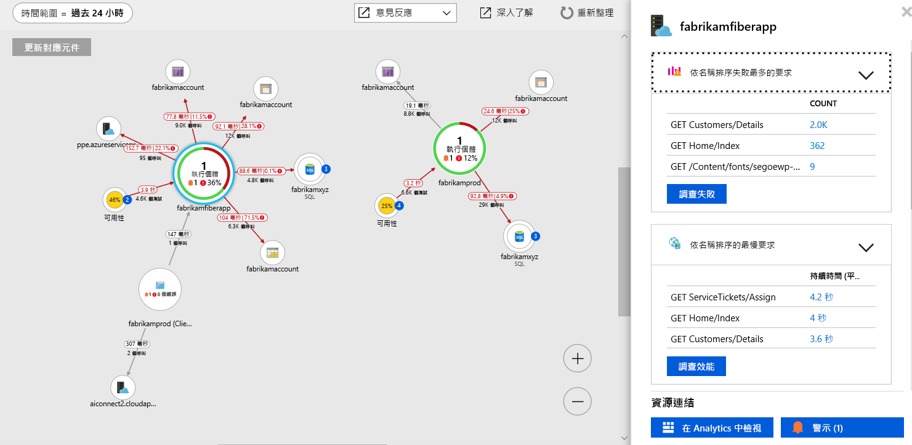

# <a name="collect-distributed-traces-from-go-preview"></a>從 Go 收集分散式追蹤 (預覽)

透過與 [OpenCensus](https://opencensus.io) 和新型[本機轉送工具](./opencensus-local-forwarder.md)的整合，Application Insights 現在已可支援 Go 應用程式的分散式追蹤。 本文將逐步引導您完成程序，以設定適用於 Go 的 OpenCensus，以及將追蹤資料傳入 Application Insights。

## <a name="prerequisites"></a>必要條件

- 您需要 Azure 訂用帳戶。
- 您應安裝 Go，本文將使用 1.11 版 [Go Download](https://golang.org/dl/)。
- 請依照下列指示安裝[本機轉送工具作為 Windows 服務](./opencensus-local-forwarder.md#windows-service)。

如果您沒有 Azure 訂用帳戶，請在開始前建立[免費帳戶](https://azure.microsoft.com/free/)。

## <a name="sign-in-to-the-azure-portal"></a>登入 Azure 入口網站

登入 [Azure 入口網站](https://portal.azure.com/)。

## <a name="create-application-insights-resource"></a>建立 Application Insights 資源

首先，您必須建立會產生檢測金鑰 (ikey) 的 Application Insights 資源。 接著，ikey 會用來設定本機轉送工具，將分散式追蹤從 OpenCensus 所檢測的應用程式傳送到 Application Insights。   

1. 選取 [建立資源] > [開發人員工具] > [Application Insights]。

   

   設定方塊隨即出現，請使用下表來填寫輸入欄位。

    | 設定        | 值           | 說明  |
   | ------------- |:-------------|:-----|
   | **名稱**      | 通用唯一值 | 此名稱可識別您要監視的應用程式 |
   | **應用程式類型** | 一般 | 您要監視的應用程式類型 |
   | **資源群組**     | myResourceGroup      | 用於裝載 App Insights 資料之新資源群組的名稱 |
   | **位置** | 美國東部 | 選擇您附近或接近應用程式裝載位置的地點 |

2. 按一下頁面底部的 [新增] 。

## <a name="configure-local-forwarder"></a>設定本機轉送工具

1. 選取 [概觀] > **[程式集]** > 複製應用程式的 [檢測金鑰]。

   

2. 編輯 `LocalForwarder.config` 檔案並新增檢測金鑰。 如果您依照[必要條件](./opencensus-local-forwarder.md#windows-service)中的指示操作，該檔案會位於 `C:\LF-WindowsServiceHost`

    ```xml
      <OpenCensusToApplicationInsights>
        <!--
          Instrumentation key to track telemetry to.
          -->
        <InstrumentationKey>{enter-instrumentation-key}</InstrumentationKey>
      </OpenCensusToApplicationInsights>
    
      <!-- Describes aspects of processing Application Insights telemetry-->
      <ApplicationInsights>
        <LiveMetricsStreamInstrumentationKey>{enter-instrumentation-key}</LiveMetricsStreamInstrumentationKey>
      </ApplicationInsights>
    </LocalForwarderConfiguration>
    ```

3. 重新啟動應用程式的**本機轉送工具**服務。

## <a name="opencensus-go-packages"></a>OpenCensus Go 套件

1. 從命令列安裝適用於 Go 的 OpenCensus 套件：

    ```go
    go get -u go.opencensus.io
    go get -u contrib.go.opencensus.io/exporter/ocagent
    ```

2. 將下列程式碼新增至 .go 檔案，然後建置並執行。 (此範例衍生自已新增程式碼以利與本機轉送工具整合的官方 OpenCensus 指引)

     ```go
        // Copyright 2018, OpenCensus Authors
        //
        // Licensed under the Apache License, Version 2.0 (the "License");
        // you may not use this file except in compliance with the License.
        // You may obtain a copy of the License at
        //
        //     http://www.apache.org/licenses/LICENSE-2.0
        //
        // Unless required by applicable law or agreed to in writing, software
        // distributed under the License is distributed on an "AS IS" BASIS,
        // WITHOUT WARRANTIES OR CONDITIONS OF ANY KIND, either express or implied.
        // See the License for the specific language governing permissions and
        // limitations under the License.
        package main
        
        import (
        
            "bytes"
            "fmt"
            "log"
            "net/http"
            os "os"
            
            ocagent "contrib.go.opencensus.io/exporter/ocagent"
            "go.opencensus.io/plugin/ochttp"
            "go.opencensus.io/plugin/ochttp/propagation/tracecontext"
            "go.opencensus.io/trace"
        
        )
        
        func main() {
            // Register stats and trace exporters to export the collected data.
            serviceName := os.Getenv("SERVICE_NAME")
            if len(serviceName) == 0 {
                serviceName = "go-app"
            }
            fmt.Printf(serviceName)
            agentEndpoint := os.Getenv("OCAGENT_TRACE_EXPORTER_ENDPOINT")

            if len(agentEndpoint) == 0 {
                agentEndpoint = fmt.Sprintf("%s:%d", ocagent.DefaultAgentHost, ocagent.DefaultAgentPort)
            }
        
            fmt.Printf(agentEndpoint)
            exporter, err := ocagent.NewExporter(ocagent.WithInsecure(), ocagent.WithServiceName(serviceName), ocagent.WithAddress(agentEndpoint))
        
            if err != nil {
                log.Printf("Failed to create the agent exporter: %v", err)
            }
        
            trace.RegisterExporter(exporter)
        
            trace.ApplyConfig(trace.Config{DefaultSampler: trace.AlwaysSample()})
        
            client := &http.Client{Transport: &ochttp.Transport{Propagation: &tracecontext.HTTPFormat{}}}
        
            http.HandleFunc("/", func(w http.ResponseWriter, req *http.Request) {
                fmt.Fprintf(w, "hello world")
        
                var jsonStr = []byte(`[ { "url": "http://blank.org", "arguments": [] } ]`)
                r, _ := http.NewRequest("POST", "http://blank.org", bytes.NewBuffer(jsonStr))
                r.Header.Set("Content-Type", "application/json")
        
                // Propagate the trace header info in the outgoing requests.
                r = r.WithContext(req.Context())
                resp, err := client.Do(r)
                if err != nil {
                    log.Println(err)
                } else {
                    // TODO: handle response
                    resp.Body.Close()
                }
            })
        
            http.HandleFunc("/call_blank", func(w http.ResponseWriter, req *http.Request) {
                fmt.Fprintf(w, "hello world")
        
                r, _ := http.NewRequest("GET", "http://blank.org", nil)

                // Propagate the trace header info in the outgoing requests.
                r = r.WithContext(req.Context())
                resp, err := client.Do(r)
        
                if err != nil {
                    log.Println(err)
                } else {
                    // TODO: handle response
                    resp.Body.Close()
                }        
            })
        
            log.Fatal(http.ListenAndServe(":50030", &ochttp.Handler{Propagation: &tracecontext.HTTPFormat{}}))
        
        }
        ```

3. Once the simple go app is running navigate to `http://localhost:50030`. Each refresh of the browser will generate the text "hello world" accompanied by corresponding span data that is picked up by the local forwarder.

4. To confirm that the **local forwarder** is picking up the traces check the `LocalForwarder.config` file. If you followed the steps in the [prerequisite](https://docs.microsoft.com/azure/application-insights/local-forwarder#windows-service), it will be located in `C:\LF-WindowsServiceHost`.

    In the image below of the log file, you can see that prior to running the second script where we added an exporter `OpenCensus input BatchesReceived` was 0. Once we started running the updated script `BatchesReceived` incremented equal to the number of values we entered:
    
    

## Start monitoring in the Azure portal

1. You can now reopen the Application Insights **Overview** page in the Azure portal, to view details about your currently running application. Select **Live Metric Stream**.

   

2. If you run the second Go app again and start refreshing the browser for `http://localhost:50030`, you will see live trace data as it arrives in Application Insights from the local forwarder service.

   

3. Navigate back to the **Overview** page and select **Application Map** for a visual layout of the dependency relationships and call timing between your application components.

    

    Since we were only tracing one method call, our application map isn't as interesting. But application map can scale to visualize far more distributed applications:

   

4. Select **Investigate Performance** to perform detailed performance analysis and determine the root cause of slow performance.

    

5. Selecting **Samples** and then clicking on any of the samples that appear in the right-hand pane will launch the end-to-end transaction details experience. While our sample app will just show us a single event, a more complex application would allow you to explore the end-to-end transaction down to level of an individual event's call stack.

     

## OpenCensus trace for Go

We only covered the basics of integrating OpenCensus for Go with the local forwarder and Application Insights. The [official OpenCensus Go usage guidance](https://godoc.org/go.opencensus.io) covers more advanced topics.

## Next steps

* [Application map](./app-insights-app-map.md)
* [End-to-end performance monitoring](./app-insights-tutorial-performance.md)