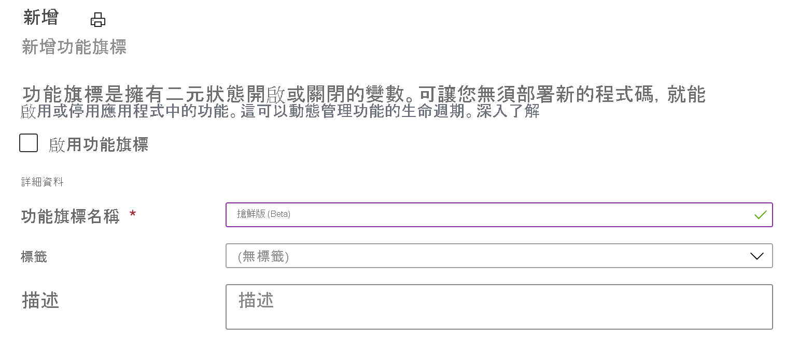

# <a name="quickstart-add-feature-flags-to-an-aspnet-core-app"></a>快速入門：將功能旗標新增至 ASP.NET Core 應用程式

在本快速入門中，您會使用 Azure 應用程式組態，在 ASP.NET Core Web 應用程式中建立功能管理的端對端實作。 您將使用應用程式組態服務來集中儲存所有功能旗標及控制其狀態。 

.NET Core 功能管理程式庫可透過全方位的功能旗標支援來擴充架構。 這些程式庫會建置在 .NET Core 組態系統之上。 並且可透過 .NET Core 組態提供者完美地與應用程式組態整合。

## <a name="prerequisites"></a>Prerequisites

* Azure 訂用帳戶 - [建立免費帳戶](https://azure.microsoft.com/free/dotnet)
* [.NET Core SDK](https://dotnet.microsoft.com/download)

## <a name="create-an-app-configuration-store"></a>建立應用程式組態存放區

[!INCLUDE[Azure App Configuration resource creation steps](../../includes/azure-app-configuration-create.md)]

8. 選取 [新增] > [功能管理員] > [新增]，以新增名為 *Beta* 的功能旗標。

    > [!div class="mx-imgBorder"]
    > 

    立即將 **標籤** 保留為空白。 選取 [套用]  以儲存新的功能旗標。

## <a name="create-an-aspnet-core-web-app"></a>建立 ASP.NET Core Web 應用程式

使用 [.NET Core 命令列介面 (CLI)](/dotnet/core/tools) 建立新的 ASP.NET Core MVC 專案。 使用 .NET Core CLI 而非 Visual Studio 的好處，在於 .NET Core CLI 在 Windows、macOS 和 Linux 平台上都可供使用。

執行下列命令，在新的 *TestFeatureFlags* 資料夾中建立 ASP.NET Core MVC Web 專案：

```dotnetcli
dotnet new mvc --no-https --output TestFeatureFlags
```

[!INCLUDE[Add Secret Manager support to an ASP.NET Core project](../../includes/azure-app-configuration-add-secret-manager.md)]

## <a name="connect-to-an-app-configuration-store"></a>連線至應用程式組態存放區

1. 藉由執行下列命令來安裝 [Microsoft.Azure.AppConfiguration.AspNetCore](https://www.nuget.org/packages/Microsoft.Azure.AppConfiguration.AspNetCore) 和 [Microsoft.FeatureManagement.AspNetCore](https://www.nuget.org/packages/Microsoft.FeatureManagement.AspNetCore) NuGet 套件：

    ```dotnetcli
    dotnet add package Microsoft.Azure.AppConfiguration.AspNetCore
    ```

    ```dotnetcli
    dotnet add package Microsoft.FeatureManagement.AspNetCore
    ```

1. 在與 *.csproj* 檔案相同的目錄中執行下列命令。 此命令會使用秘密管理員來儲存名為 `ConnectionStrings:AppConfig` 的密碼，其中儲存應用程式組態存放區的連接字串。 將 `<your_connection_string>` 預留位置取代為應用程式組態存放區的連接字串。 您可以在 Azure 入口網站中的 **[存取金鑰]** 下找到連接字串。

    ```dotnetcli
    dotnet user-secrets set ConnectionStrings:AppConfig "<your_connection_string>"
    ```

    祕密管理員僅可用於在本機測試 Web 應用程式。 當應用程式部署至 [Azure App Service](https://azure.microsoft.com/services/app-service/web) 時，請使用 App Service 中的 **連接字串** 應用程式設定 (而不是秘密管理員) 來儲存連接字串。

    使用 .NET Core 組態 API 來存取此秘密。 在所有支援的平台上，組態 API 的組態名稱中都適用冒號 (`:`)。 如需詳細資訊，請參閱[組態金鑰和值](/aspnet/core/fundamentals/configuration#configuration-keys-and-values)。

1. 在 Program.cs  中呼叫 `AddAzureAppConfiguration` 方法，將 `CreateWebHostBuilder` 方法更新為使用應用程式組態。

    > [!IMPORTANT]
    > `CreateHostBuilder` 會取代 .NET Core 3.x 中的 `CreateWebHostBuilder`。 根據您的環境選取正確的語法。

     #### <a name="net-5x"></a>[.NET 5。x](#tab/core5x)

    ```csharp
    public static IHostBuilder CreateHostBuilder(string[] args) =>
        Host.CreateDefaultBuilder(args)
            .ConfigureWebHostDefaults(webBuilder =>
                webBuilder.ConfigureAppConfiguration(config =>
                {
                    var settings = config.Build();
                    var connection = settings.GetConnectionString("AppConfig");
                    config.AddAzureAppConfiguration(options =>
                        options.Connect(connection).UseFeatureFlags());
                }).UseStartup<Startup>());
    ```

    #### <a name="net-core-3x"></a>[.NET Core 3.x](#tab/core3x)

    ```csharp
    public static IHostBuilder CreateHostBuilder(string[] args) =>
        Host.CreateDefaultBuilder(args)
            .ConfigureWebHostDefaults(webBuilder =>
                webBuilder.ConfigureAppConfiguration(config =>
                {
                    var settings = config.Build();
                    var connection = settings.GetConnectionString("AppConfig");
                    config.AddAzureAppConfiguration(options =>
                        options.Connect(connection).UseFeatureFlags());
                }).UseStartup<Startup>());
    ```

    #### <a name="net-core-2x"></a>[.NET Core 2.x](#tab/core2x)

    ```csharp
    public static IWebHostBuilder CreateWebHostBuilder(string[] args) =>
        WebHost.CreateDefaultBuilder(args)
               .ConfigureAppConfiguration(config =>
               {
                   var settings = config.Build();
                   var connection = settings.GetConnectionString("AppConfig");
                   config.AddAzureAppConfiguration(options =>
                       options.Connect(connection).UseFeatureFlags());
               }).UseStartup<Startup>();
    ```

    ---

    透過先前的變更，[應用程式組態的組態提供者](/dotnet/api/Microsoft.Extensions.Configuration.AzureAppConfiguration)已向 .NET Core 組態 API 註冊。

1. 在 *Startup.cs* 中，將參考新增至 .NET Core 功能管理員：

    ```csharp
    using Microsoft.FeatureManagement;
    ```

1. 藉由呼叫 `AddFeatureManagement` 方法更新 `Startup.ConfigureServices` 方法，以新增功能旗標支援。 (選擇性) 您可以呼叫 `AddFeatureFilter<FilterType>()`，以納入要用於功能旗標的任何篩選條件：

     #### <a name="net-5x"></a>[.NET 5。x](#tab/core5x)

    ```csharp    
    public void ConfigureServices(IServiceCollection services)
    {
        services.AddControllersWithViews();
        services.AddFeatureManagement();
    }
    ```
    #### <a name="net-core-3x"></a>[.NET Core 3.x](#tab/core3x)

    ```csharp    
    public void ConfigureServices(IServiceCollection services)
    {
        services.AddControllersWithViews();
        services.AddFeatureManagement();
    }
    ```

    #### <a name="net-core-2x"></a>[.NET Core 2.x](#tab/core2x)

    ```csharp
    public void ConfigureServices(IServiceCollection services)
    {
        services.AddMvc()
            .SetCompatibilityVersion(CompatibilityVersion.Version_2_2);
        services.AddFeatureManagement();
    }
    ```

    ---

1. 使用下列程式碼，將 *MyFeatureFlags.cs* 檔案新增至根專案目錄：

    ```csharp
    namespace TestFeatureFlags
    {
        public enum MyFeatureFlags
        {
            Beta
        }
    }
    ```

1. 使用下列程式碼，將 *BetaController.cs* 檔案新增至 *Controllers* 目錄：

    ```csharp
    using Microsoft.AspNetCore.Mvc;
    using Microsoft.FeatureManagement;
    using Microsoft.FeatureManagement.Mvc;

    namespace TestFeatureFlags.Controllers
    {
        public class BetaController: Controller
        {
            private readonly IFeatureManager _featureManager;

            public BetaController(IFeatureManagerSnapshot featureManager) =>
                _featureManager = featureManager;

            [FeatureGate(MyFeatureFlags.Beta)]
            public IActionResult Index() => View();
        }
    }
    ```

1. 在 *Views/_ViewImports. cshtml* 中，使用 `@addTagHelper` 指示詞註冊功能管理員標籤協助程式：

    ```cshtml
    @addTagHelper *, Microsoft.FeatureManagement.AspNetCore
    ```

    上述程式碼可讓 `<feature>` 標籤協助程式用於專案的 *. cshtml* 檔案中。

1. 在 *Views*\\*Shared* 目錄中，開啟 _Layout.cshtml。 找出 `<body>` > `<header>` 底下的 `<nav>` 條碼。 在 [首頁] 與 [隱私權] 導覽列項目之間插入新的 `<feature>` 標籤，如下列醒目提示的這幾行。

    :::code language="html" source="../../includes/azure-app-configuration-navbar.md" range="15-38" highlight="13-17":::

1. 建立 *Views/Beta* 目錄和 *Index. cshtml* 檔案，其中包含下列標記：

    ```cshtml
    @{
        ViewData["Title"] = "Beta Home Page";
    }

    <h1>This is the beta website.</h1>
    ```

## <a name="build-and-run-the-app-locally"></a>於本機建置並執行應用程式

1. 若要使用 .NET Core CLI 來建置應用程式，請在命令殼層中執行下列命令：

    ```dotnetcli
    dotnet build
    ```

1. 建置成功完成後，請執行下列命令以在本機執行 Web 應用程式：

    ```dotnetcli
    dotnet run
    ```

1. 開啟瀏覽器視窗，並前往 `http://localhost:5000` (這是本機所裝載 Web 應用程式的預設 URL)。 如果您在 Azure Cloud Shell 中工作，請選取 [Web 預覽]  按鈕，然後選取 [設定]  。 出現提示時，請選取連接埠 5000。

    

    您的瀏覽器應該會顯示如下圖所示的頁面。

    :::image type="content" source="media/quickstarts/aspnet-core-feature-flag-local-before.png" alt-text="變更前的本機快速入門應用程式" border="true":::

1. 登入 [Azure 入口網站](https://portal.azure.com)。 選取 [所有資源]  ，然後選取您在快速入門中建立的應用程式組態存放區執行個體。

1. 選取 [功能管理員]。 

1. 選取 [啟用] 底下的核取方塊，以啟用 [Beta] 旗標。

1. 回到命令殼層。 按 <kbd>Ctrl + C</kbd>，取消執行中的 `dotnet` 程序。 使用 `dotnet run` 重新啟動您的應用程式。

1. 重新整理瀏覽器頁面，以查看新的組態設定。

    :::image type="content" source="media/quickstarts/aspnet-core-feature-flag-local-after.png" alt-text="變更後的本機快速入門應用程式" border="true":::

## <a name="clean-up-resources"></a>清除資源

[!INCLUDE[Azure App Configuration cleanup](../../includes/azure-app-configuration-cleanup.md)]

## <a name="next-steps"></a>後續步驟

在本快速入門中，您已建立新的應用程式組態存放區，並透過[功能管理程式庫](/dotnet/api/Microsoft.Extensions.Configuration.AzureAppConfiguration)用它來管理 ASP.NET Core Web 應用程式中的功能。

* 深入了解[功能管理](./concept-feature-management.md)。
* [管理功能旗標](./manage-feature-flags.md)。
* [在 ASP.NET Core 應用程式中使用功能旗標](./use-feature-flags-dotnet-core.md)。
* [在 ASP.NET Core 應用程式中使用動態設定](./enable-dynamic-configuration-aspnet-core.md)