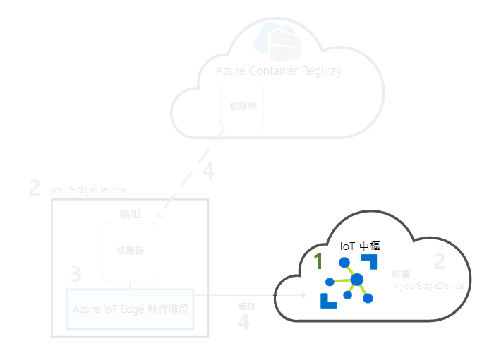
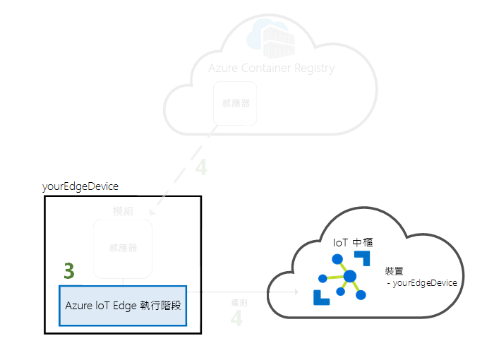

# <a name="quickstart-deploy-your-first-iot-edge-module-to-a-windows-device-preview"></a>快速入門：將您的第一個 IoT Edge 模組部署至 Windows 裝置 (Preview) 

在本快速入門中試用 Azure IoT Edge，方法是將容器化程式碼部署至 Windows IoT Edge 裝置上的 Linux。 IoT Edge 可讓您從遠端管理裝置上的程式碼，以便可以將更多的工作負載傳送到邊緣。 在本快速入門中，我們建議使用您自己的裝置，以瞭解在 Windows 上使用 Linux Azure IoT Edge 有多麼容易。

在此快速入門中，您將了解如何：

* 建立 IoT 中樞。
* 向 IoT 中樞註冊 IoT Edge 裝置。
* 在裝置上安裝並啟動 Windows 執行時間上的 Linux IoT Edge。
* 將模組從遠端部署到 IoT Edge 裝置，並傳送遙測。


本快速入門會逐步引導您瞭解如何在 Windows 裝置上設定適用于 Linux 的 Azure IoT Edge。 接著，您可以從 Azure 入口網站將模組部署至裝置。 本快速入門中使用的模組是一個模擬感應器，會產生溫度、溼度和壓力資料。 其他 Azure IoT Edge 教學課程會以您在此所做的工作為基礎，部署其他模組來分析模擬資料以產生商業見解。

如果您沒有使用中的 Azure 訂用帳戶，請在開始前建立[免費帳戶](https://azure.microsoft.com/free)。

>[!NOTE]
>Windows 上適用于 Linux 的 IoT Edge 處於 [公開預覽](https://azure.microsoft.com/support/legal/preview-supplemental-terms/)狀態。

## <a name="prerequisites"></a>必要條件

備妥環境以使用 Azure CLI。

[!INCLUDE [azure-cli-prepare-your-environment-no-header.md](../../includes/azure-cli-prepare-your-environment-no-header.md)]

雲端資源：

* 一個資源群組，用以管理本快速入門中使用的所有資源。

   ```azurecli-interactive
   az group create --name IoTEdgeResources --location westus2
   ```

IoT Edge 裝置：

* 您的裝置必須是 Windows 電腦或伺服器1809版或更新版本
* 至少 4 GB 的記憶體，建議使用 8 GB 的記憶體
* 10 GB 可用硬碟空間

## <a name="create-an-iot-hub"></a>建立 IoT 中樞

使用 Azure CLI 建立 IoT 中樞，開始進行此快速入門。



此快速入門適用於 IoT 中樞的免費層級。 如果您在過去已使用過 IoT 中樞，並已建立中樞，您可以使用該 IoT 中樞。

下列程式碼會在資源群組 `IoTEdgeResources` 中建立免費的 **F1** 中樞。 以 IoT 中樞的唯一名稱取代 `{hub_name}`。 建立 IoT 中樞可能需要幾分鐘的時間。

   ```azurecli-interactive
   az iot hub create --resource-group IoTEdgeResources --name {hub_name} --sku F1 --partition-count 2
   ```

   如果因您的訂用帳戶中已有免費中樞而發生錯誤，請將 SKU 變更為 **S1**。 如果您收到無法使用 IoT 中樞名稱的錯誤，則表示其他人已經有該名稱的中樞。 請嘗試新的名稱。

## <a name="register-an-iot-edge-device"></a>註冊 IoT Edge 裝置

向新建立的 IoT 中樞註冊 IoT Edge 裝置。


建立模擬裝置的裝置身分識別，以便與 IoT 中樞通訊。 裝置身分識別存在於雲端，您可以使用唯一的裝置連接字串，讓實體裝置與裝置身分識別建立關聯。

由於 IoT Edge 裝置的行為和管理方式不同於典型 IoT 裝置，請使用 `--edge-enabled` 旗標將此身分識別宣告為 IoT Edge 裝置。

1. 在 Azure Cloud Shell 中輸入下列命令，以在中樞內建立名為 **myEdgeDevice** 的裝置。

   ```azurecli-interactive
   az iot hub device-identity create --device-id myEdgeDevice --edge-enabled --hub-name {hub_name}
   ```

   如果您收到有關 iothubowner 原則金鑰的錯誤，請確定 Cloud Shell 正在執行最新版的 azure-iot 擴充功能。

2. 檢視裝置的連接字串，此字串將作為連結實體裝置與其在 IoT 中樞內的身分識別。 其包含 IoT 中樞的名稱、您的裝置名稱，以及用來驗證兩者間連線的共用金鑰。

   ```azurecli-interactive
   az iot hub device-identity connection-string show --device-id myEdgeDevice --hub-name {hub_name}
   ```

3. 從 JSON 輸出複製 `connectionString` 金鑰值並加以儲存。 此值示裝置連接字串。 您將在下一節中使用此連接字串來設定 IoT Edge 執行階段。

   

## <a name="install-and-start-the-iot-edge-runtime"></a>安裝並啟動 IoT Edge 執行階段

在裝置上安裝適用于 Linux 的 IoT Edge，並使用裝置連接字串進行設定。



1. [下載 Windows Admin Center](https://aka.ms/WACDownloadEFLOW)。

1. 依照安裝精靈的指示，在您的裝置上設定 Windows Admin Center。

1. 一旦您進入 Windows Admin Center，請在畫面右上方選取 **設定齒輪圖示**

1. 從 [設定] 功能表的 [閘道] 底下，選取 [**擴充** 功能]

1. 選取 [ **摘要** ] 索引標籤，然後選取 [ **新增**]。

1. https://aka.ms/wac-insiders-feed在文字方塊中輸入，然後選取 [**加入**]。

1. 新增摘要之後，請流覽至 [可用的 **擴充** 功能] 索引標籤。更新擴充功能清單可能需要一些時間。

1. 從 **可用的擴充** 功能清單中選取 **Azure IoT Edge**

1. **安裝** 延伸模組

1. 安裝延伸模組之後，請在畫面的左上角選取 **Windows Admin Center** ，以流覽至主要儀表板頁面。

1. 您會看到本機主機連接，代表您執行 Windows Admin Center 的電腦。

   :::image type="content" source="media/quickstart/windows-admin-center-start-page.png" alt-text="螢幕擷取畫面-Windows 系統管理員起始頁面":::

1. 選取 [新增]  。

   :::image type="content" source="media/quickstart/windows-admin-center-start-page-add.png" alt-text="螢幕擷取畫面-Windows 系統管理員起始頁新增按鈕":::

1. 找出 Azure IoT Edge 磚，然後選取 [ **建立新** 的]。 這將會啟動安裝精靈。

    :::image type="content" source="media/quickstart/select-tile-screen.png" alt-text="螢幕擷取畫面-Windows 磚上的 Linux Azure IoT Edge":::

1. 繼續執行安裝精靈以接受 EULA，然後選擇 **[下一步]**

    :::image type="content" source="media/quickstart/wizard-welcome-screen.png" alt-text="螢幕擷取畫面-歡迎使用 Wizard":::

1. 選擇 **選用的診斷資料** 來提供擴充的診斷資料，以協助 Microsoft 監視和維護服務品質，然後按 **[下一步：部署]**

    :::image type="content" source="media/quickstart/diagnostic-data-screen.png" alt-text="螢幕擷取畫面-診斷資料":::

1. 在 [ **選取目標裝置** ] 畫面上，選取所需的目標裝置以驗證其是否符合最低需求。 在本快速入門中，我們要將 IoT Edge 安裝在本機裝置上，因此請選擇 localhost 連線。 確認後，選擇 **[下一步]** 以繼續

    :::image type="content" source="media/quickstart/wizard-select-target-device-screen.png" alt-text="螢幕擷取畫面-選取目標裝置":::

1. 選擇 **[下一步]** 接受預設設定。

1. 部署畫面會顯示下載套件、安裝套件、設定主機和最後設定 Linux VM 的流程。  成功的部署看起來會如下所示：

    :::image type="content" source="media/quickstart/wizard-deploy-success-screen.png" alt-text="螢幕擷取畫面-Wizard 部署成功":::

1. 按一下 **[下一步]：連接** 以繼續進行最後一個步驟，以從您的 IoT 中樞實例布建您的 Azure IoT Edge 裝置及其裝置識別碼。

1. 在 Azure IoT 中樞中複製您裝置的連接字串，並將它貼到 [裝置連接字串] 欄位中。 然後選擇 **[使用選取的方法** 布建]。

    > [!NOTE]
    > 請參閱上一節中的步驟3： [註冊 IoT Edge 的裝置](#register-an-iot-edge-device)，以取得您的連接字串。

    :::image type="content" source="media/quickstart/wizard-provision.png" alt-text="螢幕擷取畫面-提供嚮導布建":::

1. 布建完成後，請選取 **[完成]** 以完成，並返回 Windows Admin Center 開始畫面。 您現在應該能夠看到您的裝置列為 IoT Edge 裝置。

    :::image type="content" source="media/quickstart/windows-admin-center-device-screen.png" alt-text="螢幕擷取畫面-Windows Admin Center Azure IoT Edge 裝置":::

1. 選取您的 Azure IoT Edge 裝置以查看其儀表板。 您應該會看到 Azure IoT 中樞中的裝置對應項的工作負載已部署。 **IoT Edge 模組清單** 應該會顯示一個模組執行中 **、edgeAgent**，而且 **IoT Edge 狀態** 應該會顯示作用中的 (執行中的 **)**。

IoT Edge 裝置現已設定完成。 並已準備好執行雲端部署的模組。

## <a name="deploy-a-module"></a>部署模組

從雲端管理您的 Azure IoT Edge 裝置，以部署會將遙測資料傳送到 IoT 中樞的模組。


[!INCLUDE [iot-edge-deploy-module](../../includes/iot-edge-deploy-module.md)]

## <a name="view-generated-data"></a>檢視產生的資料

在此快速入門中，您可以建立新的 IoT Edge 裝置，並在其中安裝 IoT Edge 執行階段。 然後，您已使用 Azure 入口網站來部署 IoT Edge 模組，使其無須變更裝置本身就能在裝置上執行。

在此案例中，您推送的模組會產生可用於稍後測試的環境資料範例。 模擬感應器會同時監視機器本身和機器的周邊環境。 例如，此感應器可能位於伺服器機房中、廠房中或風力發電機上。 訊息包含周圍溫度和溼度、機器溫度和壓力，以及時間戳記。 IoT Edge 教學課程會使用此模組所建立的資料作為分析的測試資料。

藉由流覽至 Windows Admin Center 中的命令 Shell，確認從雲端部署的模組正在 IoT Edge 裝置上執行。

1. 連接到新建立的 IoT Edge 裝置

   :::image type="content" source="media/quickstart/connect-edge-screen.png" alt-text="螢幕擷取畫面-連接裝置":::

2. 在 [ **總覽** ] 頁面上，您會看到 [ **IoT Edge 模組清單** ] 和 [ **IoT Edge 狀態** ]，您可以在其中查看已部署的各種模組以及裝置狀態。  

3. 在 [ **工具** ] 底下，選取 [ **命令 Shell**]。 命令 shell 是 PowerShell 終端機，會自動使用 ssh (安全的 shell) ，以連接到您的 Windows 電腦上 Azure IoT Edge 裝置的 Linux VM。

   :::image type="content" source="media/quickstart/command-shell-screen.png" alt-text="螢幕擷取畫面-命令 Shell":::

4. 若要確認裝置上的三個模組，請執行下列 **bash 命令**：

   ```bash
   sudo iotedge list
   ```

   :::image type="content" source="media/quickstart/iotedge-list-screen.png" alt-text="螢幕擷取畫面-命令 Shell 清單":::

5. 檢視從溫度感應器模組傳送至雲端的訊息。

   ```bash
   iotedge logs SimulatedTemperatureSensor -f
   ```

   >[!TIP]
   >IoT Edge 命令在在參考模組名稱時會區分大小寫。

   :::image type="content" source="media/quickstart/temperature-sensor-screen.png" alt-text="螢幕擷取畫面-溫度感應器":::

您也可以使用[適用於 Visual Studio Code 的 Azure IoT 中樞擴充功能](https://marketplace.visualstudio.com/items?itemName=vsciot-vscode.azure-iot-toolkit)，查看送達 IoT 中樞的訊息。

## <a name="clean-up-resources"></a>清除資源

如果您想要繼續進行 IoT Edge 教學課程，您可以使用在本快速入門中註冊和設定的裝置。 否則，您可以刪除您建立的 Azure 資源，以避免產生費用。

如果您是在新的資源群組中建立虛擬機器和 IoT 中樞，您可以刪除該群組和所有相關聯的資源。 再次檢查資源群組的內容，確定沒有您想要保留的內容。 如果您不想刪除整個群組，可改為刪除個別資源。

> [!IMPORTANT]
> 刪除資源群組是無法回復的動作。

移除 **IoTEdgeResources** 群組。 可能需要幾分鐘才能刪除資源群組。

```azurecli-interactive
az group delete --name IoTEdgeResources
```

您可以檢視資源群組清單來確認已移除資源群組。

```azurecli-interactive
az group list
```

### <a name="clean-removal-of-azure-iot-edge-for-linux-on-windows"></a>乾淨移除 Windows 上的 Linux Azure IoT Edge

您可以透過 Windows Admin Center 中的儀表板擴充功能，從 IoT Edge 裝置卸載 Windows 上的 Linux Azure IoT Edge。

1. 在 Windows Admin Center 中連線到 Windows 裝置連線上的 Linux Azure IoT Edge。 將會載入 Azure 儀表板工具擴充功能。
2. 選取 [解除安裝]。 一旦移除 Windows 上的 Linux Azure IoT Edge，Windows Admin Center 會流覽至 [開始] 頁面，並從清單中移除 Azure IoT Edge 裝置連線專案。

從 Windows 系統移除 Azure IoT Edge 的另一種方法是移至 [**開始**  >  **設定**]  >  **應用程式**  >  **Azure IoT Edge**  >  在 IoT Edge 裝置上 **卸載**。 這會從您的 IoT Edge 裝置中移除 Azure IoT Edge，但 Windows Admin Center 中保持連線。 也可以從 [設定] 功能表卸載 Windows Admin Center。

## <a name="next-steps"></a>後續步驟

在本快速入門中，您已建立 IoT Edge 裝置，並使用 Azure IoT Edge 雲端介面將程式碼部署至裝置上。 現在，您已有測試裝置，可產生其環境的相關原始資料。

下一個步驟是設定您的本機開發環境，以便您可以開始建立執行您商務邏輯的 IoT Edge 模組。

> [!div class="nextstepaction"]
> [開始開發 IoT Edge 課程模組](tutorial-develop-for-linux.md)
