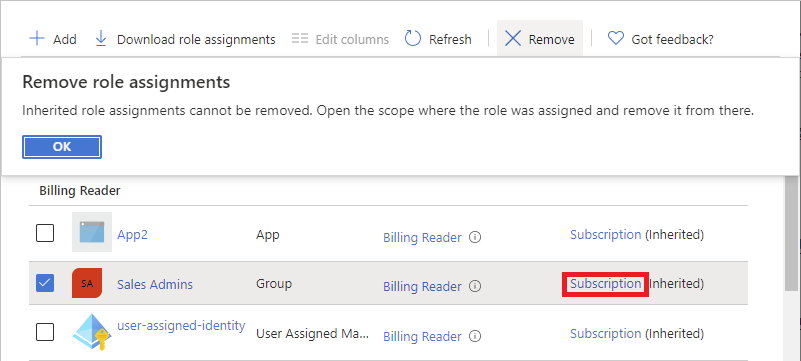

# 使用 RBAC 和 Azure 入口網站來管理存取權

[角色型存取控制 (RBAC)](overview.md) 是您對 Azure 中的資源存取進行管理的機制。 本文說明如何使用 RBAC 和 Azure 入口網站來管理使用者、群組和應用程式的存取權。

## 列出角色

角色定義是您用於角色指派的權限集合。 Azure 有超過 70 個[內建角色](built-in-roles.md)。 在入口網站中依照下列步驟來列出角色。

1. 在 Azure 入口網站中，選擇 [所有服務]，然後選擇 [訂用帳戶]。

1. 選擇您的訂用帳戶。

1. 選擇 [存取控制 (IAM)]。

   

1. 選擇 [角色] 以查看所有內建和自訂角色的清單。

   

   您可以查看指派給每個角色的使用者和群組數目。

   

## 列出存取權

在管理存取權時，您想要知道誰具有存取權、其權限為何，以及在何種層級上。 若要列出存取權，您可以列出角色指派。 依照下列步驟來列出使用者的存取權，並列出不同範圍的存取權。

### 列出使用者的角色指派

1. 在導覽清單中，選擇 [Azure Active Directory]。

1. 選擇 [使用者] 以開啟 [所有使用者]。

   

1. 在清單中選擇個別使用者。

1. 在 [管理] 區段中，選擇 [Azure 資源]。

   

   在 [Azure 資源] 刀鋒視窗上，您可以查看所選使用者和所選訂用帳戶的角色指派。 此清單只會針對您有權讀取的資源列出其角色指派。 例如，如果使用者也有您無法讀取的角色指派，這些角色指派將不會出現在清單中。

1. 如果您有多個訂用帳戶，則可以選擇 [訂用帳戶] 下拉式清單，來查看不同訂用帳戶中的角色指派。

### 列出資源群組的角色指派

1. 在導覽清單中，選擇 [資源群組]。

1. 選擇資源群組，然後選擇 [存取控制 (IAM)]。

   在 [存取控制 (IAM)] 刀鋒視窗上 (也稱為身分識別和存取管理)，您可查看誰可以存取此資源群組。 請注意，某些角色的範圍限於**此資源**，而有些角色則是來自 **(繼承自)** 另一個範圍。 存取權不是特別指派給資源群組，就是繼承自父訂用帳戶的指派。

   

### 列出訂用帳戶的角色指派

1. 在 Azure 入口網站中，選擇 [所有服務]，然後選擇 [訂用帳戶]。

1. 選擇您的訂用帳戶。

1. 選擇 [存取控制 (IAM)]。

    在 [存取控制 (IAM)] 刀鋒視窗上，您可查看誰可以存取此訂用帳戶及其角色。

    

    傳統訂用帳戶管理員和共同管理員被視為 RBAC 模型中訂用帳戶的擁有者。

### 列出管理群組的角色指派

1. 在 Azure 入口網站中，選擇 [所有服務]，然後選擇 [管理群組]。

1. 選擇您的管理群組。

1. 針對您選取的管理群組選擇 [(詳細資料)]。

    

1. 選擇 [存取控制 (IAM)]。

    在 [存取控制 (IAM)] 刀鋒視窗上，您可查看誰可以存取此管理群組及其角色。

    

## 授與存取權

在 RBAC 中，若要授與存取權，您必須指派角色。 依照下列步驟來授與不同範圍的存取權。

### 在資源群組範圍中指派角色

1. 在導覽清單中，選擇 [資源群組]。

1. 選擇資源群組。

1. 選擇 [存取控制 (IAM)]，以查看資源群組範圍中目前的角色指派清單。

   

1. 選擇 [新增] 以開啟 [新增權限] 窗格。

   如果您沒有指派角色的權限，就不會看到 [新增] 選項。

   

1. 在 [角色] 下拉式清單中選取角色，例如 [虛擬機器參與者]。

1. 在 [選取] 清單中，選取使用者、群組或應用程式。 如果在清單中未看到安全性主體，您可以在 [選取] 方塊中輸入，以在目錄中搜尋顯示名稱、電子郵件地址和物件識別碼。

1. 選擇 [儲存] 以指派角色。

   在幾分鐘之後，即會在資源群組範圍中指派安全性主體的角色。

### 在訂用帳戶範圍指派角色

1. 在 Azure 入口網站中，選擇 [所有服務]，然後選擇 [訂用帳戶]。

1. 選擇您的訂用帳戶。

1. 選擇 [存取控制 (IAM)]，以查看訂用帳戶範圍中目前的角色指派清單。

   

1. 選擇 [新增] 以開啟 [新增權限] 窗格。

   如果您沒有指派角色的權限，就不會看到 [新增] 選項。

   

1. 在 [角色] 下拉式清單中選取角色，例如 [虛擬機器參與者]。

1. 在 [選取] 清單中，選取使用者、群組或應用程式。 如果在清單中未看到安全性主體，您可以在 [選取] 方塊中輸入，以在目錄中搜尋顯示名稱、電子郵件地址和物件識別碼。

1. 選擇 [儲存] 以指派角色。

   在幾分鐘之後，即會在訂用帳戶範圍中指派安全性主體的角色。

### 指派使用者做為訂用帳戶的系統管理員

若要將使用者設定為 Azure 訂用帳戶的系統管理員，請在訂用帳戶範圍為其指派[擁有者](built-in-roles.md#owner)角色。 「擁有者」角色可授與使用者訂用帳戶中所有資源的完整存取權，包括將存取權委派給其他人的權限。 針對任何其他角色指派，這些步驟都相同。

1. 在 Azure 入口網站中，選擇 [所有服務]，然後選擇 [訂用帳戶]。

1. 選擇您的訂用帳戶。

1. 選擇 [存取控制 (IAM)]，以查看訂用帳戶範圍中目前的角色指派清單。

   

1. 選擇 [新增] 以開啟 [新增權限] 窗格。

   如果您沒有指派角色的權限，就不會看到 [新增] 選項。

   

1. 在 [角色] 下拉式清單中，選取 [擁有者] 角色。

1. 在 [選取] 清單中，選取使用者。 如果在清單中未看到使用者，您可以在 [選取] 方塊中輸入，以在目錄中搜尋顯示名稱與電子郵件地址。

1. 選擇 [儲存] 以指派角色。

   在幾分鐘之後，即會在訂用帳戶範圍將「擁有者」角色指派給使用者。

### 在管理群組範圍指派角色

1. 在 Azure 入口網站中，選擇 [所有服務]，然後選擇 [管理群組]。

1. 選擇您的管理群組。

1. 針對您選取的管理群組選擇 [(詳細資料)]。

    

1. 選擇 [存取控制 (IAM)]，以查看訂用帳戶範圍中目前的角色指派清單。

   

1. 選擇 [新增] 以開啟 [新增權限] 窗格。

   如果您沒有指派角色的權限，就不會看到 [新增] 選項。

   

1. 在 [角色] 下拉式清單中選取角色，例如 [管理群組參與者]。

    如需有關各種角色對管理群組支援的動作詳細資訊，請參閱[使用 Azure 管理群組來組織資源](../governance/management-groups/index.md#management-group-access)。

1. 在 [選取] 清單中，選取使用者、群組或應用程式。 如果在清單中未看到安全性主體，您可以在 [選取] 方塊中輸入，以在目錄中搜尋顯示名稱、電子郵件地址和物件識別碼。

1. 選擇 [儲存] 以指派角色。

   在幾分鐘之後，即會在管理群組範圍中指派安全性主體的角色。

## 移除存取

在 RBAC 中，若要移除存取權，您可以移除角色指派。 依照下列步驟來移除存取權。

### 移除角色指派

1. 確認您要移除的角色指派，然後開啟具有這些指派的管理群組、訂用帳戶、資源群組或資源的 [存取控制 (IAM)] 刀鋒視窗。

1. 在角色指派清單中，在具有您要移除的角色指派安全性主體旁加上核取記號。

   

1. 選擇 [移除]。

   

1. 在顯示的移除角色指派訊息中，選擇 [是]。

    繼承的角色指派無法移除。 如果您需要移除繼承的角色指派，您必須在建立角色指派的範圍中進行移除。 在 [範圍] 資料行中 [(繼承)] 的旁邊有一個連結，會將您帶往已指派該角色的範圍。 移至該處所列的範圍來移除角色指派。

   

## 後續步驟

* [快速入門 - 使用 RBAC 與 Azure 入口網站為使用者授與存取權](quickstart-assign-role-user-portal.md)
* [教學課程 - 使用 RBAC 與 Azure PowerShell 為使用者授與存取權](tutorial-role-assignments-user-powershell.md)
* [內建角色](built-in-roles.md)
* [使用 Azure 管理群組來組織資源](../azure-resource-manager/management-groups-overview.md)
