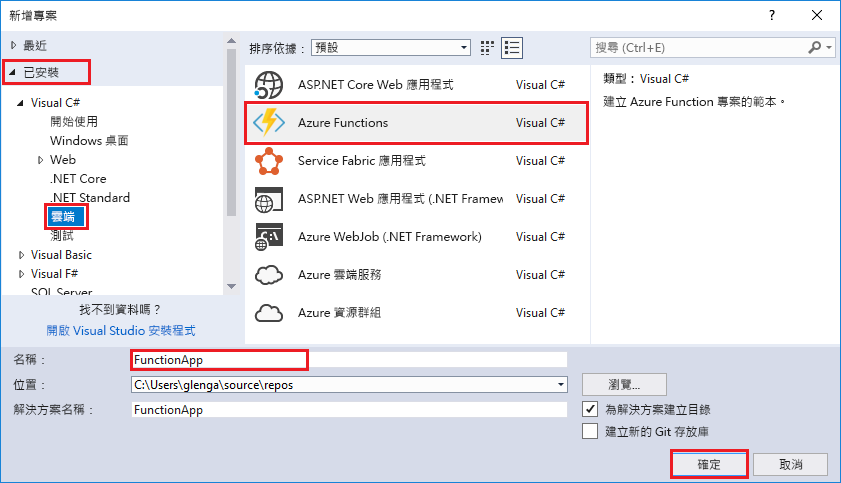
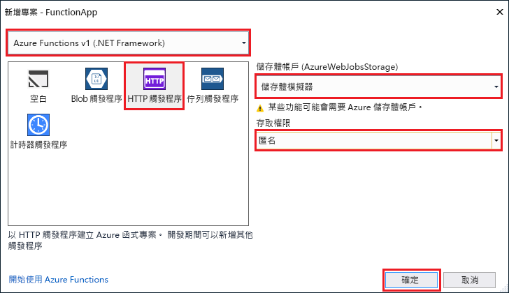

Visual Studio 中的 Azure Functions 專案範本會建立可發行至 Azure 中函式應用程式的專案。 函式應用程式可讓您將多個函式群組為邏輯單位，以便您管理、部署和共用資源。

1. 在 Visual Studio 中，從 [檔案] 功能表中選取 [新增]  >  [專案]。

2. 在 [新增專案] 對話方塊中，選取 [已安裝]，展開 [Visual C#]  >  [雲端]，選取 [Azure Functions]，輸入專案的 [名稱]，然後按一下 [確定]。 函式應用程式名稱必須是有效的 C# 命名空間，因此不會使用底線、連字號或任何其他非英數字元。

    

3. 使用影像下方資料表中所指定的設定。

     

    | 設定      | 建議的值  | 說明                      |
    | ------------ |  ------- |----------------------------------------- |
    | **版本** | Azure Functions v1  (.NET Framework) | 這樣會建立使用 Azure Functions 第 1 版執行階段的函式專案。 支援 .NET Core 的第 2 版執行階段目前是預覽版。 如需詳細資訊，請參閱[如何設定 Azure Functions 執行階段目標版本](../articles/azure-functions/functions-versions.md)。   |
    | **範本** | HTTP 觸發程序 | 這樣會建立 HTTP 要求所觸發的函式。 |
    | **儲存體帳戶**  | 儲存體模擬器 | HTTP 觸發程序不會使用儲存體帳戶連線。 其他所有觸發程序類型都需要有效的儲存體帳戶連接字串。 |
    | **存取權限** | 匿名 | 建立的函式可以由任何用戶端觸發，而不需提供金鑰。 此授權設定可以讓測試新函式變得簡單。 如需金鑰和授權的詳細資訊，請參閱 [HTTP 和 Webhook 繫結](../articles/azure-functions/functions-bindings-http-webhook.md)中的[授權金鑰](../articles/azure-functions/functions-bindings-http-webhook.md#authorization-keys)。 |
4. 按一下 [確定] 以建立函式專案和 HTTP 觸發函式。

